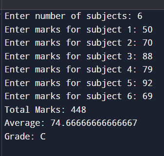

# Student Grade Calculator (Java)

A simple Java console-based application that calculates the total marks, average score, and grade of a student based on subject marks entered by the user.

---

## Project Description

The **Student Grade Calculator** is a beginner-friendly Java project that demonstrates basic programming concepts such as user input handling, loops, conditional statements, and arithmetic operations.

The program asks the user to enter the number of subjects and corresponding marks, then calculates:

* Total Marks
* Average Score
* Final Grade

---

## Features

* Accepts multiple subject marks
* Calculates total and average automatically
* Assigns grade based on average marks
* Simple command-line interface

---

## Technologies Used

* Java
* Scanner Class
* Conditional Statements
* Loops

---

## Project Structure

```
StudentGradeCalculator/
│── StudentGradeCalculator.java
│── README.md
```

---

## How to Run the Project

### Compile the program

```
javac StudentGradeCalculator.java
```

### Run the program

```
java StudentGradeCalculator
```


---

## Sample Output


---


